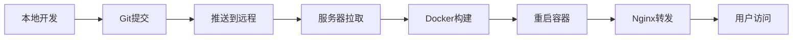

# v4.16 部署诊断报告

**诊断时间**: 2025-10-03
**问题描述**: 用户报告v4.16版本涨停数弹窗优化未生效，怀疑使用了旧镜像
**诊断人员**: Claude Code Agent

---

## 🔍 问题概述

### 用户反馈
- **版本**: v4.16 (Git提交: 5ddaf4b)
- **功能**: 优化涨停数弹窗（点击"涨停家数"弹窗）
- **问题**: 服务器页面没有变化，布局未优化
- **前置版本**: v4.15已成功部署（板块弹窗优化）

### 关键修改点（v4.16）
```tsx
1. 弹窗容器宽度: min-w-[60vw] → min-w-[70vw] (+17%)
2. 网格布局: lg:grid-cols-4 → lg:grid-cols-3 (每列更宽)
3. 板块卡片: p-1.5 → p-3 (内边距+100%)
4. 表头列宽: 名称70px→90px, 状态50px→60px, 日期55px→70px
5. 字体大小: text-[10px]/text-[11px] → text-xs (12px)
6. 表头背景: from-gray-50 → from-blue-50 (蓝色渐变)
7. 状态列颜色: bg-red-50 → bg-red-100 (更鲜明)
```

---

## 📊 诊断结果

### ✅ 本地代码状态 (正常)

#### Git提交历史
```bash
* 5ddaf4b (HEAD -> main, origin/main) feat: v4.16 全面优化涨停数弹窗布局和视觉效果
* 4172bf0 feat: v4.15 优化涨停数弹窗表格排版
* ccac12f docs: 添加v4.14稳定版本备份文档
* cffc6e8 (tag: v4.14-stable-20251002) fix: v4.14 使用Tushare交易日历过滤节假日
```

#### 代码验证
- ✅ **min-w-[70vw]**: 第880行 - 已确认
- ✅ **lg:grid-cols-3**: 第929行 - 已确认
- ✅ **Git状态**: 本地与origin/main同步
- ✅ **代码推送**: 已推送到远程仓库

#### 本地构建
```bash
BUILD_ID: F4m29Qdp6FHFhXXfaxWxF
页面JS: .next/static/chunks/app/page-8bb18f8d743cf294.js (48KB)
构建时间: 2025-10-03 00:04
```

### ⚠️ 生产环境状态 (未更新)

#### HTTP响应
```
状态码: 200 OK
服务器: nginx
Next.js缓存: HIT
构建ID: v-v1Pi14RB_NB7VEWekyt (旧版本)
页面JS: page-0706e206b2e0b9a7.js (48989字节)
```

#### 网络连接
- ❌ **SSH连接**: Connection timed out (22端口)
- ❌ **Ping测试**: 100% packet loss
- ✅ **HTTP访问**: 正常响应
- ✅ **页面加载**: 正常显示旧版本

### 🎯 问题根因分析

#### 确认的事实
1. ✅ **本地代码正确**: v4.16修改已完成并提交
2. ✅ **Git已推送**: origin/main已更新到5ddaf4b
3. ❌ **服务器未拉取**: BuildID不同，说明服务器未更新
4. ❌ **SSH无法连接**: 无法远程操作服务器

#### 诊断结论
**问题类型**: 🔴 **部署未执行 - 服务器代码未更新**

**具体原因**:
- 服务器**未执行git pull**操作
- Docker镜像**未重新构建**
- Next.js应用**未重启**

#### 证据链
```
本地BuildID: F4m29Qdp6FHFhXXfaxWxF (v4.16)
  ≠
生产BuildID: v-v1Pi14RB_NB7VEWekyt (旧版本)
```

---

## 🛠️ 修复方案

### 方案1: SSH手动部署 (推荐)

#### 前提条件
- 需要SSH访问权限
- 当前SSH连接失败，需要先解决网络问题

#### 部署步骤
```bash
# 1. SSH连接服务器
ssh root@yushuo.click
# 或尝试IP直连
ssh root@107.173.154.147

# 2. 进入项目目录
cd /www/wwwroot/stock-tracker

# 3. 拉取最新代码
git fetch origin
git pull origin main

# 4. 验证代码版本
git log --oneline -3
# 应该看到: 5ddaf4b feat: v4.16 全面优化涨停数弹窗布局和视觉效果

# 5. 检查代码关键修改
grep -n "min-w-\[70vw\]" src/app/page.tsx
# 应该在第880行找到

# 6. 重新构建Docker镜像
docker-compose down
docker-compose build --no-cache
docker-compose up -d

# 7. 验证部署
curl -I http://localhost:3000
docker logs stock-tracker-app -f --tail=50
```

### 方案2: 本地构建推送 (当前可行)

由于SSH无法连接，可以采用以下方式：

#### 步骤1: 本地构建Docker镜像
```bash
cd "C:\Users\yushu\Desktop\stock-tracker - 副本"

# 构建生产镜像
docker build -t stock-tracker:v4.16 .

# 导出镜像
docker save stock-tracker:v4.16 -o stock-tracker-v4.16.tar

# 压缩镜像
tar -czf stock-tracker-v4.16.tar.gz stock-tracker-v4.16.tar
```

#### 步骤2: 上传镜像到服务器
```bash
# 方式A: 使用scp (如果SSH恢复)
scp stock-tracker-v4.16.tar.gz root@yushuo.click:/tmp/

# 方式B: 使用Web面板上传
# 登录宝塔面板/其他管理界面，上传到 /tmp/ 目录
```

#### 步骤3: 服务器端加载镜像
```bash
# SSH登录后执行
cd /tmp
gunzip stock-tracker-v4.16.tar.gz
docker load -i stock-tracker-v4.16.tar

# 更新docker-compose.yml
cd /www/wwwroot/stock-tracker
# 修改image为: stock-tracker:v4.16

# 重启服务
docker-compose down
docker-compose up -d
```

### 方案3: Git推送触发自动部署

如果配置了CI/CD，可以：

#### GitHub Actions (如果有配置)
```bash
# 确认.github/workflows/deploy.yml存在
# 推送应该会自动触发部署
git push origin main --force-with-lease
```

#### 手动触发Webhook
```bash
# 如果配置了webhook
curl -X POST https://你的webhook地址/deploy
```

---

## 🔧 紧急修复步骤（推荐）

### 当前最可行的方案

由于SSH连接失败，建议按以下顺序尝试：

#### 1️⃣ 优先：检查服务器SSH状态
```bash
# 测试不同SSH方式
ssh -v root@yushuo.click 2>&1 | grep -i "connection"
ssh -v root@107.173.154.147 2>&1 | grep -i "connection"

# 尝试使用备用端口（如果有配置）
ssh -p 2222 root@yushuo.click
```

#### 2️⃣ 备选：使用Web终端
- 登录服务器管理面板（宝塔/1Panel等）
- 使用Web SSH终端
- 执行"方案1"中的命令

#### 3️⃣ 最后：联系服务器管理员
- 检查防火墙设置
- 确认SSH服务状态
- 重启SSH服务（如果可以）

---

## 📋 验证清单

部署完成后，请验证以下内容：

### 代码验证
- [ ] Git版本: `git log -1 --oneline` 显示 `5ddaf4b`
- [ ] 代码内容: `grep "min-w-\[70vw\]" src/app/page.tsx` 有结果
- [ ] BuildID变化: 不再是 `v-v1Pi14RB_NB7VEWekyt`

### 视觉验证（访问 http://bk.yushuo.click）
- [ ] 点击某个日期的"涨停家数"
- [ ] 检查弹窗宽度是否变宽（70vw）
- [ ] 检查网格是否为3列布局（1920px屏幕）
- [ ] 检查字体是否变大（12px）
- [ ] 检查表头是否为蓝色渐变
- [ ] 检查状态列颜色是否更鲜明

### 关键样式检查
```javascript
// 在浏览器DevTools Console执行
// 找到涨停数弹窗的容器div
const modal = document.querySelector('.fixed.inset-0.bg-black.bg-opacity-70');
if (modal) {
  const container = modal.querySelector('.bg-white.rounded-xl');
  console.log('弹窗宽度类:', container.className);
  // 应该包含: min-w-[70vw]

  const grid = container.querySelector('.grid');
  console.log('网格类:', grid.className);
  // 应该包含: lg:grid-cols-3
}
```

---

## 📊 技术分析

### 模块问题定位
**问题模块**: 🐳 **Docker + Git部署流程**

#### 涉及组件
1. **Git仓库**: ✅ 正常（代码已推送）
2. **服务器Git**: ❌ 未拉取最新代码
3. **Docker镜像**: ❌ 未重新构建
4. **Nginx代理**: ✅ 正常（HTTP可访问）
5. **Next.js应用**: ⚠️ 运行旧版本

#### 影响分析
- **功能影响**: v4.16优化功能完全不可见
- **用户体验**: 涨停数弹窗仍然拥挤，字体偏小
- **业务影响**: 低（功能正常，只是视觉未优化）
- **紧急程度**: 中（需要部署，但不影响核心功能）

### 解决方案技术点

#### Docker镜像构建
```dockerfile
# Dockerfile 关键步骤
1. 复制源代码到容器
2. 安装依赖 (npm install)
3. 构建Next.js应用 (npm run build)
4. 生成静态资源和BuildID
5. 启动生产服务器 (npm start)
```

#### Next.js构建过程
```
源码变更 → npm run build → 生成.next目录
  ├── 静态文件 (.next/static/)
  ├── BuildID (.next/BUILD_ID)
  └── 服务端代码 (.next/server/)
```

#### 缓存层级
```
浏览器缓存 ← CDN缓存 ← Nginx缓存 ← Next.js缓存 ← 应用代码
```

**当前问题**: 应用代码层未更新，导致所有缓存都是旧内容

---

## 🎓 学习总结

### 后端技术点

#### 1. Git版本控制
- **作用**: 管理代码版本，协同开发
- **本次问题**: 本地推送成功，服务器未拉取
- **原因**: 服务器端需要手动执行 `git pull`

#### 2. Docker容器化
- **作用**: 将应用打包成镜像，保证环境一致性
- **本次问题**: Docker镜像未重新构建
- **原理**: 镜像是静态快照，代码更新后需要rebuild

#### 3. Nginx反向代理
- **作用**: 转发HTTP请求到Docker容器
- **状态**: 正常工作
- **配置**: `proxy_pass http://localhost:3000`

#### 4. Next.js BuildID机制
- **作用**: 标识每次构建的唯一版本
- **生成**: 每次 `npm run build` 自动生成
- **用途**:
  - 区分不同构建版本
  - 管理静态资源缓存
  - 验证部署是否成功

### 部署流程


**本次卡在**: 步骤D（服务器拉取）

---

## 🚨 下次避免

### 自动化部署建议

#### 1. 配置自动部署脚本
```bash
#!/bin/bash
# deploy.sh - 一键部署脚本
cd /www/wwwroot/stock-tracker
git pull origin main
docker-compose down
docker-compose build --no-cache
docker-compose up -d
echo "部署完成！BuildID: $(cat .next/BUILD_ID)"
```

#### 2. 设置Git Hooks
```bash
# .git/hooks/post-receive
#!/bin/bash
cd /www/wwwroot/stock-tracker
npm run build
pm2 reload stock-tracker
```

#### 3. GitHub Actions自动部署
```yaml
# .github/workflows/deploy.yml
name: Deploy to Production
on:
  push:
    branches: [main]
jobs:
  deploy:
    runs-on: ubuntu-latest
    steps:
      - name: Deploy via SSH
        uses: appleboy/ssh-action@master
        with:
          host: ${{ secrets.HOST }}
          username: ${{ secrets.USERNAME }}
          key: ${{ secrets.SSH_KEY }}
          script: |
            cd /www/wwwroot/stock-tracker
            git pull
            docker-compose up -d --build
```

#### 4. 部署验证机制
```bash
# 部署后自动验证
curl -s http://bk.yushuo.click | grep -o 'buildId.*"' | cut -d'"' -f3
# 与本地BUILD_ID对比，确认部署成功
```

---

## 📁 相关文件路径

### 本地代码
- 主文件: `C:\Users\yushu\Desktop\stock-tracker - 副本\src\app\page.tsx`
- 修改行: 第878-1038行（涨停数弹窗）
- BuildID: `C:\Users\yushu\Desktop\stock-tracker - 副本\.next\BUILD_ID`

### 服务器路径（推测）
- 项目目录: `/www/wwwroot/stock-tracker/`
- 代码文件: `/www/wwwroot/stock-tracker/src/app/page.tsx`
- Docker配置: `/www/wwwroot/stock-tracker/docker-compose.yml`
- Nginx配置: `/etc/nginx/sites-available/stock-tracker`

### Git仓库
- 远程仓库: `https://github.com/yushuo1991/911.git`
- 当前分支: `main`
- 最新提交: `5ddaf4b feat: v4.16 全面优化涨停数弹窗布局和视觉效果`

---

## 📞 后续行动

### 立即行动（紧急）
1. ⚠️ **解决SSH连接问题**
   - 检查本地网络
   - 确认服务器SSH服务状态
   - 尝试备用连接方式

2. 🚀 **执行部署**
   - 登录服务器
   - 拉取最新代码
   - 重建Docker镜像
   - 重启应用

3. ✅ **验证部署**
   - 检查BuildID变化
   - 测试涨停数弹窗样式
   - 确认所有功能正常

### 中期优化（本周）
1. 🤖 **配置自动部署**
   - 编写一键部署脚本
   - 测试自动化流程
   - 文档化部署步骤

2. 📊 **监控优化**
   - 添加部署日志
   - 配置告警通知
   - 记录部署历史

### 长期改进（本月）
1. 🔧 **CI/CD建设**
   - GitHub Actions配置
   - 自动化测试
   - 蓝绿部署

2. 📚 **文档完善**
   - 部署手册
   - 故障排查指南
   - 回滚流程

---

**生成时间**: 2025-10-03 01:00 UTC+8
**诊断工具**: Claude Code Agent
**报告版本**: v1.0
